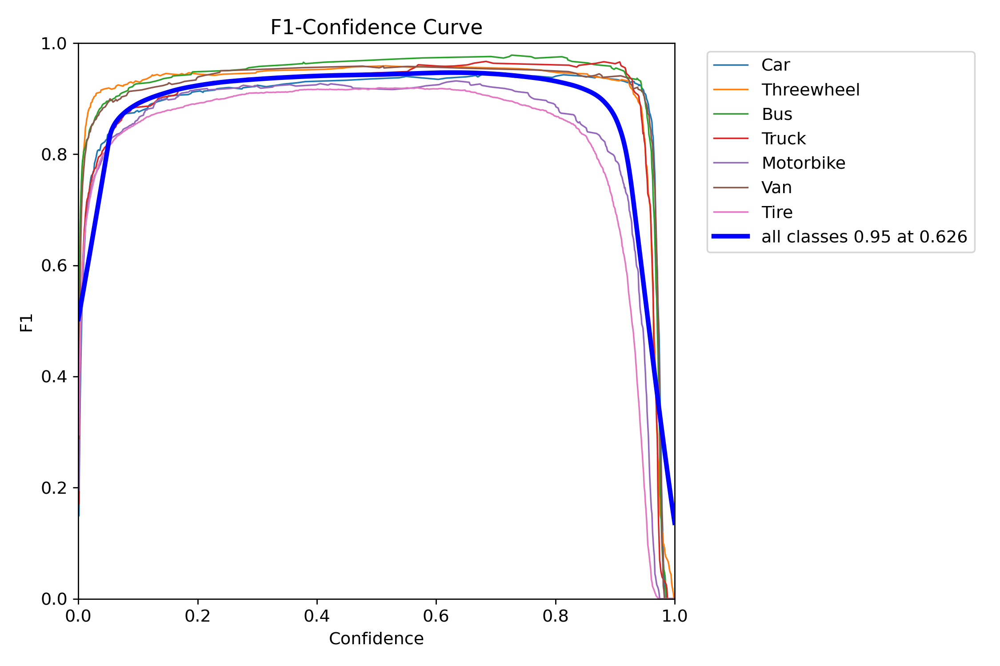

# Sistema Inteligente de Clasificación Vehicular para la Gestión de Tráfico y Seguridad Vial Mediante Percepción Computaciona

## Caso Practico de Titulación 
## Autor
Luis Daniel Ortega Astudillo

Maestría en Inteligencia Artificial Aplicada - Universidad Hemisferios


## Descripción del Proyecto

Este proyecto presenta un sistema inteligente para la detección y conteo automatizado de llantas (ejes) de vehículos, utilizando técnicas de percepción computacional y deep learning. El sistema está diseñado para como un servicio, capaz de procesar secuencias de imágenes de vehículos capturadas por un sistema externo.

El objetivo principal es mejorar la eficiencia y precisión en la clasificación vehicular y el conteo de ejes, abordando las ineficiencias, costos y errores de los métodos manuales o semiautomatizados en sectores como el control de peajes, la seguridad vial y la logística. 

La solución emplea un modelo de detección de objetos **Ultralytics YOLO11**  entrenado para identificar diversos tipos de vehículos y sus llantas. Esto se complementa con una robusta lógica de software en Python para:
* Asociar llantas a su vehículo correspondiente.
* Manejar solapamientos parciales y vehículos de fondo.
* Realizar un conteo preciso de llantas.
* Enviar los resultados a un servidor externo.

El sistema ha sido desarrollado con un enfoque modular y altamente configurable, permitiendo su adaptación a diferentes parámetros y la integración con sistemas externos a través de una API HTTP (Flask) para la comunicación entre módulos o la recepción de trabajos.

## Motivación y Problema Abordado

Los procesos tradicionales de verificación y conteo de ejes/llantas dependen en gran medida de:
* Inspección visual manual, sujeta a error humano, fatiga y costos elevados.
* Sistemas semi-automatizados básicos (celdas de carga, lazos inductivos) que pueden ser imprecisos con configuraciones vehiculares complejas y son susceptibles a fallos.
* Declaraciones de conductores, que pueden ser inexactas.

Estas limitaciones conllevan a pérdidas económicas, ineficiencia operativa, datos poco fiables y riesgos de seguridad. El presente proyecto busca solventar estas deficiencias mediante una solución tecnológica avanzada.

## Áreas de Aplicación

* **Operadores de Peaje y Concesiones Viales:** Para tarificación precisa.
* **Control de Tránsito y Seguridad Vial:** Fiscalización y detección de configuraciones anómalas.
* **Empresas de Logística y Transporte de Carga:** Gestión de flotas, cumplimiento normativo y mantenimiento predictivo.

## Objetivo General
Desarrollar e implementar un prototipo funcional de un sistema basado en percepción computacional e inteligencia artificial capaz de detectar vehículos y contar de forma precisa el número de llantas (para inferir ejes) para cada vehículo en diversos escenarios operativos, con el fin de mejorar la eficiencia y la toma de decisiones en sistemas de peaje y control vial.

### Componentes del Software
El sistema está estructurado en los siguientes módulos Python:
* `main.py`: Orquestador principal, incluye el servidor Flask para recibir trabajos y el hilo trabajador.
* `config_loader.py` y `config.yaml`: Para la gestión centralizada de todos los parámetros.
* `input_handler.py` (Clase `JobInputController`): Maneja la lectura de datos de entrada para cada trabajo.
* `detector.py` (Clase `ObjectDetector`): Encapsula el modelo YOLO y su carga.
* `tracker_logic.py` (Clase `TireCounterLogic`): Contiene la lógica de conteo y asociación.
* `api_client.py` (Clase `APIClient`): Envía resultados al servidor externo.
* `utils.py`: Funciones de utilidad (ej. `compute_iou`, `encode_image_to_base64`).
* `server_receptor.py`: Un servidor Flask de ejemplo para recibir y visualizar los datos.

### Tecnologías Clave
El sistema está estructurado en los siguientes módulos Python:
* **[Python](https://www.python.org/):** Lenguaje principal de desarrollo.
* **[Ultralytics YOLO](https://github.com/ultralytics/ultralytics):** Modelo de deep learning para detección de objetos.
* **[ByteTrack](https://github.com/ifzhang/ByteTrack):** Algoritmo de seguimiento de objetos. (Nota: Usaste el de FoundationVision antes, ajusta si es otro fork el principal que quieres referenciar)
* **[OpenCV](https://opencv.org/):** Procesamiento de imágenes y video.
* **[Flask](https://flask.palletsprojects.com/):** Microframework web para el servidor de comandos interno y el servidor receptor.
* **[Requests](https://requests.readthedocs.io/):** Librería para realizar peticiones HTTP.
* **[PyYAML](https://pyyaml.org/wiki/PyYAMLDocumentation):** Para la carga y gestión de la configuración desde el archivo `config.yaml`.
* **[NumPy](https://numpy.org/):** Para operaciones numéricas eficientes.

### Dataset y Entrenamiento
* Se utilizaron datasets de Kaggle: **["Vehicle Dataset for YOLO"](https://www.kaggle.com/datasets/nadinpethiyagoda/vehicle-dataset-for-yolo):** y **["Vehicle Wheel Detection | Axle Detection"](https://www.kaggle.com/datasets/dataclusterlabs/vehicle-wheel-detection):**.
* El segundo dataset se usó para entrenar un modelo detector de llantas, el cual luego se empleó para auto-etiquetar las llantas en el primer dataset.
* Posteriormente, se realizó una revisión y corrección manual de las etiquetas utilizando [CVAT](https://www.cvat.ai/).
* El modelo final de vehículos y llantas se entrenó partiendo de yolo11n.pt pre-entrenado en COCO, con 25 épocas. A continuación, observamos las metricas obtenidas.


**Curva PR (Precisión-Exhaustividad):**

La curva PR ilustra el balance entre la precisión y la exhaustividad para todas las clases.


**Curva F1:**

La curva F1 muestra la puntuación F1 en función del umbral de confianza, ayudando a identificar el punto óptimo.



**Matriz de Confusión:**

La matriz de confusión visualiza el rendimiento de la clasificación para cada clase, mostrando las instancias correctamente clasificadas y los errores de clasificación.


## Configuración y Ejecución

### Requisitos Previos
* Python 3.8+
* Dependencias listadas en `requirements.txt` (generar con `pip freeze > requirements.txt`).
    * `ultralytics`
    * `opencv-python`
    * `Flask`
    * `requests`
    * `numpy`
    * `PyYAML`
* Un modelo YOLO (`best.pt`) entrenado para las clases especificadas.
* (Opcional) Un sistema de captura de imágenes externo que guarde secuencias en carpetas.
* (Opcional) Un servidor receptor corriendo (`server_receptor.py`) si `external_server.enabled` es `True`.

### Configuración
Todos los parámetros se gestionan a través del archivo `config.yaml`. Asegúrate de revisar y ajustar:
* `source`: Tipo y ruta para el modo `watch_folder` o para ejecución única si no se usa el servidor de comandos.
* `model`: Rutas a los archivos del modelo y configuración del tracker.
* `classes`: Nombres de clases y cuáles son vehículos/llantas.
* `confidence_thresholds`: Umbrales de confianza por clase.
* `tire_logic`: Parámetros para la asociación y filtros de llantas (IoU, expansión de caja, posición Y, tamaño).
* `processing`: `debug_mode`, `show_visualization_per_job`, configuración del video para el payload.
* `command_server`: Configuración del servidor Flask interno en `main.py`.
* `external_server`: Configuración del servidor externo al que se envían los resultados.

### Ejecución
1.  **(Opcional) Iniciar el Servidor Receptor:**
    ```bash
    python server_receptor.py
    ```
2.  **Iniciar la Aplicación Principal (Servicio de Conteo):**
    ```bash
    python main.py
    ```
    La aplicación cargará el modelo YOLO y, si está habilitado, iniciará el servidor Flask en el puerto especificado (ej. 5001) para esperar órdenes de trabajo. También comenzará a monitorear la `watch_folder_path` si `source.type` está configurado como `watch_folder`.

3.  **Enviar un Trabajo (Ejemplo usando postman):**
    

4.  **Enviar un Trabajo (Ejemplo usando curl):**
    ```bash
    curl -X POST -H "Content-Type: application/json" -d "{\"source_type\": \"image_folder\", \"source_path\": \"E:/MaestriaIA/PruebasPrototipo/camion3/\"}" [http://127.0.0.1:5001/process_vehicle_data](http://127.0.0.1:5001/process_vehicle_data)
    ```
    Reemplaza la ruta y el puerto si es necesario.

5.  **Alternativa para Ejecución Única:**
    ```bash
    python main.py --process_folder "E:/MaestriaIA/PruebasPrototipo/camion3"
    ```

5.  **En caso de usar server_receptor.py:**
    Abrir en el navegador: http://192.168.68.103:5005/
    Recargar la página despues de cada deteccion para refrescar los resultados, ejemplo de los resultados:

    


## Resultados en video (clic para reproducir)
[]([processed_videos/camion.mp4](https://www.youtube.com/watch?v=Nu2CSzB1M34))

## Consideraciones Éticas y de Impacto
El sistema maneja imágenes que pueden ser sensibles. Se han considerado los siguientes puntos:
* **Privacidad:** Minimización de datos, evitar almacenamiento innecesario, y cumplimiento de regulaciones.
* **Sesgos del Modelo:** Necesidad de datasets diversos y auditorías para evitar rendimiento desigual.
* **Errores y Fiabilidad:** Importancia de la validación y posible supervisión humana para decisiones críticas.
* **Seguridad del Sistema:** Protección contra accesos no autorizados.
* **Impacto Laboral:** Considerar estrategias de adaptación para el personal.

## Próximos Pasos y Mejoras Futuras
* Pruebas piloto extensivas en entornos reales.
* Ajuste fino continuo de parámetros de configuración.
* Implementación de logging avanzado.
* Desarrollo de un dashboard o UI para operadores.
* Integración con otros sistemas empresariales.
* Mejoras en la lógica de asociación contextual y manejo de solapamientos severos.

